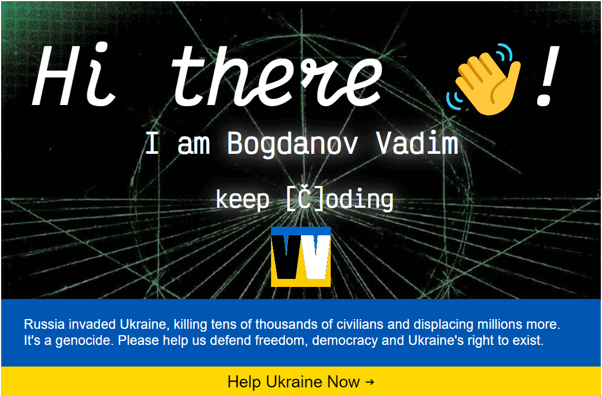
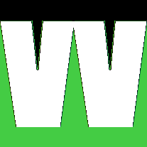

<!-- <h1 style="background-image: './cover.png';">
Hi there 👋! I am <a href="https://vadym4che.github.io">Vadym Chervoniak</a>
</h1> -->

<!-- 
 -->

<!-- My expertise includes
,
,
,
,
,
,
various databases, cloud computing, and integrating with different APIs, helping me to deliver complex web development solutions. -->
<!-- I am Vadym Chervoniak, -->
I am Vadym Chervoniak a Full-stack developer based in Ukraine. My expertise includes HTML, CSS, JavaScript, React, Vue, Node.js, various databases, cloud computing, and integrating with different APIs, helping me to deliver complex web development solutions.

*  *  *  *

As individuals, we are all born developers, constantly shaping our neural networks as we journey through life.  
Some of us, including myself, have chosen to transform this passion for development into a fulfilling career in web development.  
For me, it's not just a job but a calling that allows me to express my creativity and make a meaningful impact through technology.

*  *  *  *

We each have our own unique story to tell, and through the language of technology, we code our autobiographies, breathing life into our ideas on the digital canvas.  
I am deeply dedicated to creating user-friendly web applications and continually enhancing my skills to stay ahead in this ever-evolving industry.  

 

  

 

<i>I've earned my own very first PC</i>
  

<i>By working summer holidays in 2003</i>
  

<i>I'm a 'web dev loco' (if you will) code-addict</i>
  

<i>Devoted to development with JavaScript</i>
  

<i>I'm experienced enough to exactly know</i>
  

<i>Using DOCs, AI, Google and Stackoverflow</i>
  

<!--  --><!--  -->   

<!--
**vadym4che/vadym4che** is a ✨ _special_ ✨ repository because its `README.md` (this file) appears on your GitHub profile.

Here are some ideas to get you started:

- 🔭 I’m currently working on ...
- 🌱 I’m currently learning ...
- 👯 I’m looking to collaborate on ...
- 🤔 I’m looking for help with ...
- 💬 Ask me about ...
- 📫 How to reach me: ...
- 😄 Pronouns: ...
- ⚡ Fun fact: ...
-->

<!--  -->

